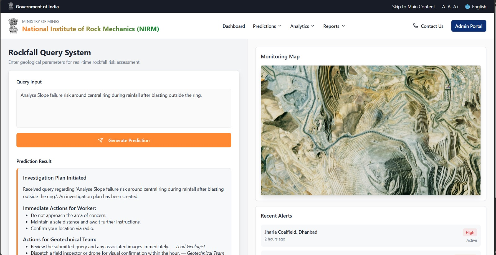

# Netherite: AI-Powered Rockfall Prediction System

**Team Gradient Ascent | SIH 2025 Problem Statement #25071**

An AI-driven rockfall prediction framework that fuses multi-source data inputs for predictive rockfall analysis through interactive simulations, providing real-time risk maps and automated alerts for open-pit mine safety.

## Problem Statement

Rockfalls in open-pit mines pose significant threats to personnel and equipment, resulting in serious injuries, operational delays, and financial losses. Traditional rockfall detection systems rely on visual inspection or expensive proprietary solutions that are either labor-intensive or lack real-time predictive capabilities.

## Solution Overview
<div align="center">
</div>

### [Prototype link](https://netherite-ga.vercel.app/)
```
Netherite is a smart, AI-based system designed to predict potential rockfall incidents in
open-pit mines by processing multi-source data inputs
and providing actionable insights for proactive decision-making.
```

### Key Features

- **Real-time Risk Assessment**: Continuous monitoring and prediction of rockfall events
- **Multi-source Data Integration**: Processes DEM files, drone imagery, geotechnical sensor data, and environmental factors
- **Physics, ML and GIS simluations**: Physics-Engine driven rockfall scenario modelling and GIS-based Monte-Carlo Tree Simulations (MCTS)
  and other stochastic modelling to produce risk maps and scenario modelling.
- **Interactive Dashboard**: Centralized monitoring with automated alerts and action plan recommendations
- **3D Visualization**: Real-time 3D maps and dynamic zonal assessment
- **Automated Alert System**: SMS/Email notifications with evacuation and prevention plans
- **IoT Integration**: Network of sensors for capturing geotechnical properties


## Architecture

### Core Components

1. **SAFE-ROCK Model**: Custom deep learning model for rockfall prediction with 96%+ accuracy
2. **Point Cloud Processing**: 3D geometric feature learning from LiDAR and drone data
3. **Physics Simulation**: Unreal Engine-powered realistic rockfall scenario modeling
4. **Agentic Framework**: Multi-agent system for risk assessment and action planning
5. **Interactive Dashboard**: Real-time visualization and alert management

### Data Pipeline

```
Satellite DEM Data 
       ↓                                      
Drone & Sensor Data → Point Cloud SLAM → SAFE-ROCK Model → Risk Maps/Regions → Physics Simulations 
                                                                   ↓                    ↓
                                                             Alert Systems       Risk Assessment 
```

## Technology Stack

### Software
- **AI/ML**: Python, PyTorch, Open3D
- **Simulation**: Unreal Engine, AirSim
- **GIS**: QGIS, PDAL, OpenDroneMap
- **Backend**: Python, C/C++
- **Frontend**: NextJS, Figma
- **Computer Vision**: OpenCV

### Hardware
- **Sensors**: LM393 Soil Moisture, LM35 Temperature, Piezo Sensors
- **LiDAR**: R2300 LiDAR Sensors
- **Processing**: Raspberry Pi
- **UAV**: Drone-mounted RGB-Depth sensors

## Repository Structure

```
Netherite/
├── AirSIMClient_Python/          # Drone simulation and control scripts
│   ├── drone_lidar.py            # LiDAR data collection
│   ├── point_cloud.py            # Point cloud processing
│   ├── survey.py                 # Automated survey missions
│   ├── navigate.py               # Drone navigation controls
│   ├── takeoff.py                # Takeoff procedures
│   ├── land.py                   # Landing procedures
│   ├── orbit.py                  # Orbital flight patterns
│   ├── multi_agent_drone.py      # Multi-drone coordination
│   ├── stability_test.py         # System stability testing
│   └── ...                       # Additional drone control utilities
├── pl2map/                       # Point-Line SLAM implementation
│   ├── cfgs/                     # Configuration files
│   ├── datasets/                 # Dataset handling
│   ├── detectors/                # Feature detection algorithms
│   ├── models/                   # ML model definitions
│   ├── runners/                  # Training and inference scripts
│   ├── util/                     # Utility functions
│   └── prepare_scripts/          # Data preparation scripts
├── BinghamCanyon.zip             # Sample mine environment data
├── settings.json                 # AirSim configuration
└── requirements.txt              # Python dependencies
```

## Installation and Setup

### Prerequisites

- Python 3.8+
- Unreal Engine 4.27+ (for AirSim simulation)
- QGIS 3.x
- CUDA-capable GPU (recommended)

### Installation Steps

1. **Clone the repository**
   ```bash
   git clone https://github.com/shreshth3000/Netherite.git
   cd Netherite
   ```

2. **Install Python dependencies**
   ```bash
   pip install -r requirements.txt
   ```

3. **Setup AirSim Environment**
   - Extract `BinghamCanyon.zip` to your Unreal Engine projects folder
   - Copy `settings.json` to your AirSim configuration directory
   
4. **Configure QGIS Plugin**
   - Install QProto/RockGIS plugin for QGIS integration

## Usage

### 1. Data Collection


**Drone Survey**
```bash
cd AirSIMClient_Python
python my_own_api_control.py

**Point Cloud Processing**
```bash
cd pl2map
python runners/train.py --config cfgs/config.yaml
```
Final Mesh after Point Cloud SLAM viewed in CloudCompare:

### 2. Risk Assessment
Risk Assessment leverages advanced AI and stocastic models that analyze processed point cloud and sensor data to dynamically evaluate slope stability and identify zones vulnerable to rockfalls. 
The SAFE-ROCK framework integrates multi-source environmental and geotechnical indicators, providing probability-based forecasts and generating real-time risk maps to proactively alert mine planners of potential hazards.

### 3. Visualization and Monitoring



## Demo
### Video Demonstration
Watch our complete system demonstration: [Demo Video Link](https://www.youtube.com/playlist?list=PL-ANRltKCRELH1nNYLh0Cz0Ex2trSvJ73)

The demo showcases:
- Real-time UAV simulation in opencast mine environment
- Point cloud processing and 3D visualization
- Risk zone identification and alert generation
- Interactive dashboard functionality

### Key Demo Features

1. **3D Mine Environment**: Realistic open-pit mine simulation using Unreal Engine
2. **Drone Navigation**: Autonomous UAV flight paths for comprehensive mine surveying
3. **Real-time Processing**: Live point cloud analysis and risk assessment
4. **Alert Generation**: Automated notification system with action recommendations


## Model Performance

### SAFE-ROCK Model Results

| Model | Balanced Accuracy | Precision | Recall | F1 Score |
|-------|------------------|-----------|--------|----------|
| PointNet | 0.84 | 0.51/0.99 | 0.84/0.75 | 0.45/0.85 |
| PointNet++ (SSG) | 0.96 | 0.54/0.99 | 0.96/0.92 | 0.56/0.95 |
| **Our Model (SAFE-ROCK)** | **0.96** | **0.55/0.99** | **0.97/0.93** | **0.57/0.96** |

<div align="center">
</div>

### Key Metrics

- **Accuracy**: 96%+ rockfall prediction accuracy
- **Terrain Compatibility**: 87% compatibility across different terrains  
- **ROI**: 320% return on investment
- **Cost Savings**: ₹11.5 Crore prevention per major incident

## Technical Approach

### Multi-Source Data Processing

1. **Photogrammetric Analysis**: Processes drone imagery to identify rock instabilities
2. **Environmental Monitoring**: Converts sensor data (moisture, vibration, temperature) into risk indicators
3. **3D Geometric Learning**: Learns from raw point clouds to capture density variations
4. **Spatiotemporal Modeling**: Simulates rock fragmentation and trajectories over time

### Agentic Framework

<!--[PLACEHOLDER: Diagram showing multi-agent system architecture]-->

- **Orchestration Agent**: Coordinates overall system operation
- **Risk Assessment Agent**: Evaluates current slope stability conditions  
- **Planning Agent**: Generates action plans based on risk analysis
- **Prevention Agent**: Implements proactive safety measures
- **Validation Agent**: Verifies system predictions and recommendations

### IoT-Driven Sensor Network

**Sensor Types**:
- LM393 Soil Moisture Sensors
- LM35 Temperature Sensors  
- Piezoelectric Vibration Sensors
- R2300 LiDAR Range Sensors

## Impact and Benefits

### Operational Benefits

- **Operational Continuity**: Maintains uninterrupted production through predictive monitoring
- **Cost Savings**: Reduces accident-related losses and insurance liabilities  
- **Compliance**: Meets safety regulations and builds reputation
- **Scalability**: Adaptable for different mine sites and terrains

### Societal Impact

- **Worker Safety**: Prevents casualties through early warning systems
- **Environmental Protection**: Minimizes ecological damage from slope failures
- **Economic Stability**: Safeguards mineral supply chains and prevents market disruption

## Research and Publications

### Technical Papers

- SAFE-ROCK Architecture and Implementation: [Our Research Paper Link](https://drive.google.com/file/d/1zhonB7K3gBh6H4WwwxaeGuIxgWQduuIY/view)
- 3D Rockfall Trajectory Simulation: [DOI Link](https://www.researchgate.net/publication/382393540_Rock-fall_runout_simulation_using_a_QGIS_plugin_along_north-west_coast_of_Malta_Mediterranean_Sea)

### References

Key research foundations:
- RockyFor3D: 3D rockfall trajectory simulation
- QGIS Plugin for Rockfall Runout analysis  
- Comprehensive 3D defect detection using deep learning
- Spatiotemporal point-based neural networks

## Team

**Gradient Ascent** - SIH 2025
- Ujjwal Kakar
- Shreshth Rai
- Vanshika
- Abhinav Rajput
- Sarthak Verma
- Nikunj Gupta


